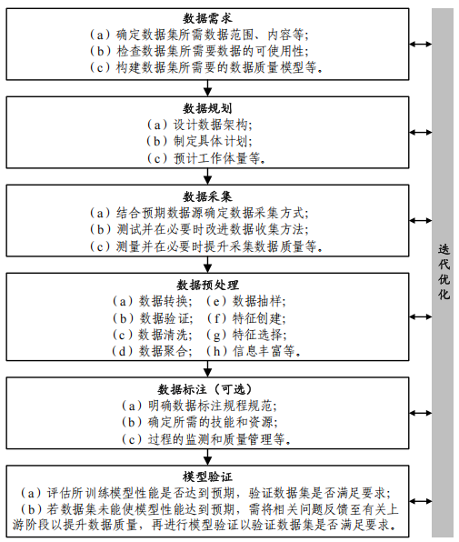

### 高质量数据集定义
#### 高质量数据集(high-quality dataset)
经过采集、加工等数据处理，可直接用于开发和训练人工智能模型，能有效提升模型性能的数据集合。(全国数据标准化技术委员会) 

#### 数据质量(data quality)
在指定条件下使用时，数据的特性满足明确的隐含要求程度。

#### 数据质量模型(data quality model)
已定义的特性集合，提供一个框架用于说明数据质量需求和评价数据质量

#### 数据标注(data labeling)
对数据样本指定目标变量和赋值的过程

#### 数据架构(data architecture)
对企业业务数据类型和来源、逻辑数据资产、物理数据资产和数据管理资源结构和交互的描述。

#### 有监督机器学习(supervised machine learning)
仅只使用标注数据进行训练的机器学习

### 建设方案

高质量数据集建设方法

高质量数据集，是指在特定业务或应用场景下，在真实性、完整性、准确性、一致性、时效性、可用性和合规性等方面达到较高标准，能够稳定、可信地支撑分析决策、模型训练或业务运行的数据集合。
高质量数据集=“可信、可用、可复用、可持续演进”的数据资产。
高价值应用、高知识密度、高技术含量

#### 数据需求
数据需求主要是胡定人工智能应用对数据的需求，即根据预期人工智能用途明确数据集在数据范围、内容、可用、质量等方面的需求。
* 确定数据集所需要的数据范围、内容等，根据预期人工智能应用，明确具体需需要哪些数据，包括数据格式、统计特性和可分性，即训练、验证、测试数据等子集的有效划分说明。
* 检查数据集所需要数据的可使用性，即确认用于特定人工智能应用的数据是否可获取并使用
* 构建数据集所需要的数据质量模型，即实例化一个具有相关数据质量特性、完整性、准确性、一致等的数据质量模型。

#### 数据规划
数据规划阶段主要是确保所用数据满足数据需求阶段的要求，同时为使用这些数据完成人工智能应用的目标提供支持。
* 设计数据架构，界定所需数据的全部属性、来源、范围等
* 制定具体计划，即制定涵盖数据采集、数据预处理、数据标注、模型验证等阶段的具体计划，包括各阶段实施计划、数据质量计划等，以满足数据规范等方面要求；
* 预计工作体量，即预估获得和准备数据以支持特定人工智能应用所需的工作量，可能包括任何必要的数据重组、传输或收集的时间，以及为特定人工智能应用构建数据质量模型的时间。
#### 数据采集

#### 数据预处理

#### 数据标注

#### 模型验证

### 高质量数据类型要素
高质量数据集可以分为通识、行业通识、行业专识三类，分别用于支撑通用、行业、场景模型落地应用。
* 知识内容：数据集中所蕴含知识的专业性、知识深度、目标受众。
* 来源类型：数据的获取来源，如网络资源、文献类型、系统平台、组织机构等。
* 时效性：数据更新的速度和有效期限。
* 标注人员类型：数据进行标注或审核的人员类型
* 敏感程度：数据公开后所产生的风险程度
* 模型类型：数据支持开发和训练人工智能模型的类型
* 主题范围：数据所涉及的通用知识领域、行业领域、业务场景等范围。